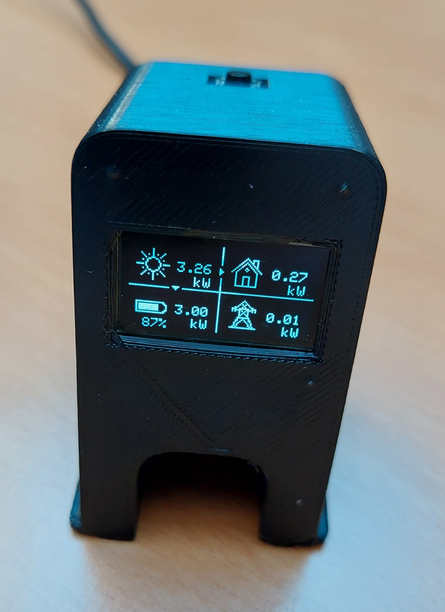

# SolarEdge Modbus Monitor for ESP8266 tiss

This project builds a hardware monitor to show values from a SolarEdge inverter on an OLED 0.96" display.

Here is a picture of the assembled monitor showing solar data.

This is how the back looks like. There is a hole for connecting the monitor with USB to power or programm it.

## Features

* Displays solar energy intensity
* Displays battery charge/discharge and loading state
* Displays power usage
* Displays power transfer from/to grid
* Web config interface for WIFI and Modbus connection data
* Switch button for multiple screens

## Environment

* Tested with ESP8266 on Wemos D1 mini
* Tested with SolarEdge SE7K inverter with BYD battery box
* Tested with Modbus over TCP

## Housing

I used a housing called [3D Printer Monitor for OctoPrint Wemos D1 ESP8266](https://www.thingiverse.com/thing:2884823) from [Thingiverse](https://www.thingiverse.com) build by [Qrome](https://www.thingiverse.com/qrome/designs). Many thanks for this design.

## Parts and wiring

Required parts

* Wemos D1 mini (1x)
* 0.96 incl OLED display with I2C bus (1x)
* 10k resistor (1x)
* push button (1x)

The following image shows the components and their wiring.

## Configuration

When you start the monitor for the first time it will display "Init WiFi connection - Access Point Mode" or "Init WiFi connection - Not configured".
In both states the monitor opens an WiFi access point with SSID "SolarEdgeMonitor". Connect to this access point using your mobile or tablet. 

After the connection has been established the following config screen is shown. Fill in the values according to your environment.

* Thing name: Name of the monitor in the network
* AP password: Password of the monitor´s access point. Will be required when you reconnect to the monitor after completing the configuration.
* WiFi SSID: SSID of the WiFi you want the monitor to connect to. The SolarEdge inverter has to be reachable from that WiFi.
* WiFi password: Password of the WiFi.

* Inverter IP: IP address of the SolarEdge inverter
* Inverter port: Modbus port of the SolarEge inverter

### Modbus Proxy

As my SolarEdge inverter accepts only one Modbus client I use [modbus-proxy](https://pypi.org/project/modbus-proxy/) on a Raspberry Pi. 
The proxy makes it possible for multiple clients to query data from the inverter. If you have only one client like this SolarEdge monitor connecting to the inverter you can live without a proxy of course.

### Configuration reset
You can reset the configuration by pressing the button for about 5 seconds. The display will show "Configuration reset - press again to reset". 
Press again to reset the configuration or remove power to prevent a config reset.

## Screens

There are two screens available at the moment which can be toggled by double clicking the button.

### Screen 1

Screen 1 is made up of four quadrants.

* Top left - sun: shows the current power the inverter produces from the solar panels
* Bottom left - battery: shows the power transfered to (loading) and from the battery (discharging) and the fill grade of the battery.
* Top right: house: shows the power used by the house.
* Bottom right - grid: shows the power received from or sent to the power grid.

The little triangled arrows between the quadrants indicate the direction of the power flow. Example: In case the top of the triangle is pointing towards the battery then the battery is loading.

### Screen 2

Non graphical representation of the data from screen 1. Primarly used for testing screen toggling and reserved for further extensions.

## Libraries

This project uses the following libraries. Thanks to all creators and contributors.

* [emelianov/modbus-esp8266](https://github.com/emelianov/modbus-esp8266)
* [stscde/modbus-esp8266-solaredge](https://github.com/stscde/modbus-esp8266-solaredge)
* OneButton
* IotWebConf
* several Adafruit libraries

## Building

This library was created using [PlatformIO](https://platformio.org/) for [Visual Studio Code](https://code.visualstudio.com/).

To build the project with PlatformIO use the following steps:

* clone the repository from GitHub to your workspace
* compile and upload

## Last Changes

* first release no changes yet

## License

The code in this repo is licensed under the BSD New License. See LICENSE.txt for more info.